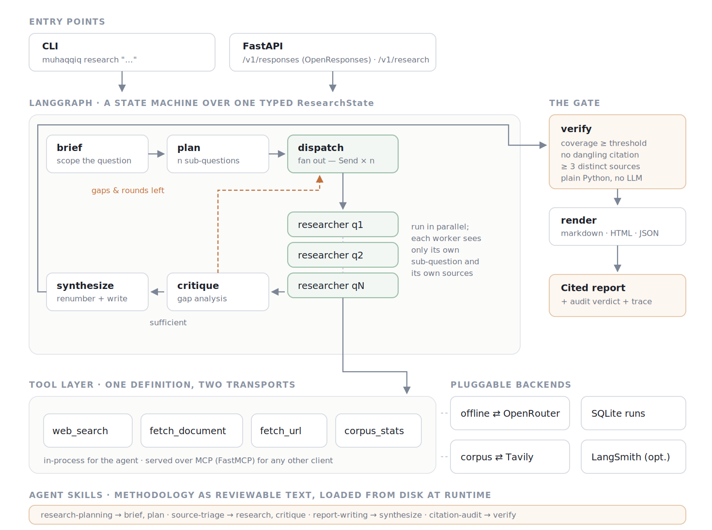
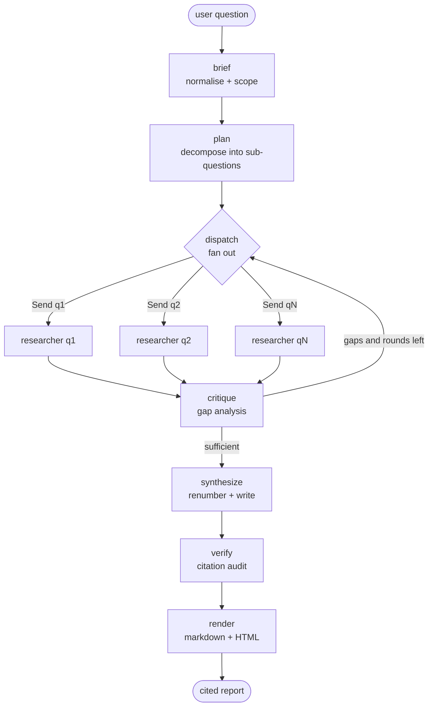

<div align="center">

# مُحَقِّق · Muhaqqiq

**وكيل بحثي متعدد الوكلاء يرفض نشر أي ادعاء لا يستطيع نسبته إلى مصدر.**

[](https://www.python.org/)
[](https://langchain-ai.github.io/langgraph/)
[](https://gofastmcp.com/)
[](LICENSE)

*مشروع التخرج — هندسة أنظمة الذكاء الاصطناعي الوكيلي المتقدمة*
*أكاديمية سدايا · أغسطس ٢٠٢٦*

[English](README.md) · [مثال على المُخرَج](examples/run_example.md) · [المعمارية](#المعمارية)

</div>

---

> **يعمل بدون أي مفاتيح API.** الأمر `uv sync && uv run muhaqqiq research "..."` يُشغّل
> الوكيل كاملاً — التخطيط، والبحث المتوازي، والنقد الذاتي، وتدقيق الاستشهادات — على
> مجموعة وثائق محلية مرفقة، خلال ثانية تقريباً. وإضافة المفاتيح توجّه الرسم البياني نفسه
> إلى نماذج حقيقية وإلى الويب المباشر.

---

## المشكلة

اسأل نموذجاً لغوياً سؤالاً بحثياً تحصل على نص سلس خلال خمس ثوانٍ. وغالباً ما يكون النص
صحيحاً. المشكلة أنك **لا تستطيع تمييز الأجزاء الصحيحة منه**، والنموذج نفسه لا يستطيع
ذلك — فهو ينتج الفقرة الواثقة ذاتها سواء استرجع خمس دراسات ذات صلة أم لم يسترجع شيئاً
على الإطلاق.

ولهذا الإخفاق شكل محدّد:

| الإخفاق | سببه | كلفته |
|---|---|---|
| إجابات واثقة بلا مصدر | فصل التوليد عن الاسترجاع | على القارئ إعادة البحث بنفسه ليثق بها |
| استشهادات مُختلَقة | لا شيء يتحقق أن `[3]` يشير إلى وثيقة حقيقية | أسوأ من غياب الاستشهاد، لأنه *يبدو* موثّقاً |
| فشل استرجاع صامت | «لم أجد شيئاً» و«الإجابة هي كذا» يسلكان المسار نفسه | يُضلَّل القارئ دون أي إشارة |
| تلخيص من مصدر واحد | لا مقياس لتنوّع المصادر | يُقدَّم تلخيص لمدونة واحدة على أنه بحث |

فينتهي الأمر بالقارئ إلى أداء العمل بنفسه على أي حال: يفتح كل رابط، ويتحقق مما إذا كانت
الوثيقة تقول فعلاً ما ينسبه إليها الملخّص. لم يوفّر الوكيل وقتاً؛ بل نقل الجهد إلى مرحلة
لاحقة وأضاف مسودة مقنعة الظاهر تحتاج إلى مجادلة.

**لمن هذا المشروع؟** لكل من يلزمه إنتاج إجابة مكتوبة قابلة للدفاع عنها من مصادر لم
يكتبها: المحلّلون، والطلبة، والمهندسون الذين يستكشفون تقنية جديدة عليهم، وكل من يُعدّ
إحاطة لا تُقبل فيها عبارة «قرأتُ ذلك في مكان ما» كاستشهاد.

**ما الذي يغيّره مُحَقِّق؟** كل جملة جوهرية في المُخرَج تحمل علامة تُحيل إلى وثيقة
مسترجَعة حقيقية، والتقرير يخبرك — في أعلاه، قبل أن تقرأ منه كلمة — ما نسبة ادعاءاته
المنسوبة إلى مصادر، وعلى كم مصدر متمايز يستند، وما الذي أخفق في معرفته. يُسمح للوكيل أن
ينتج تقريراً ضعيفاً؛ ولا يُسمح له أن ينتج تقريراً ضعيفاً يبدو قوياً.

---

## ما الذي يفعله مُحَقِّق

```
سؤال المستخدم
      ↓
يحوّله الوكيل إلى موجز محدود النطاق      ─── ما الداخل في النطاق وما الخارج منه
      ↓
يفكّكه إلى n سؤالاً فرعياً                ─── متعامدة، قابلة للبحث بشكل مستقل
      ↓
n وكيلاً باحثاً يعملون بالتوازي            ─── كل واحد لا يرى إلا سؤاله الفرعي
      ↓                                        ومصادره هو
يدقّق الناقد التغطية                       ─── أدلة ضعيفة ← جولة استرجاع أخرى
      ↓                                        (محدودة؛ لا يمكنه الدوران إلى ما لا نهاية)
يوفّق الكاتب بين الإجابات الفرعية           ─── تُرقَّم الاستشهادات حتمياً
      ↓
يحكم مدقّق الاستشهادات على النتيجة          ─── التغطية، والعلامات المعلّقة، والتنوّع
      ↓
تقرير موثّق + حكم التدقيق + أثر التنفيذ     ─── Markdown · HTML · JSON
```

الاسم عربي: **مُحَقِّق** — الباحث المُدقِّق، وكذلك العالِم الذي يُحقّق المخطوطة ويوثّقها
قبل نشرها. والمعنيان معاً هما مهمّة المشروع.

---

## كيف يعمل الوكيل

### ١. الموجز — تحديد نطاق السؤال

يُعاد صوغ السؤال الخام بدقّة ويُمنح نطاقاً صريحاً: ما يجب أن تتضمنه الإجابة الجيدة
(`success_criteria`)، وما يُستبعد عمداً (`scope_out`)، ومن هو القارئ. المُخرَج كائن
`ResearchBrief` مُنمَّط، لا فقرة نصية.

### ٢. التخطيط — التفكيك إلى أوجه متعامدة

يُصدر المخطِّط من ٣ إلى ٥ كائنات `SubQuestion`، لكلٍّ منها استعلامات بحثه الخاصة. ويُشترط
ألّا تتداخل: فإن كانت فقرة واحدة تكفي للإجابة عن سؤالين فرعيين، فقد كان ينبغي أن يكونا
سؤالاً واحداً. ومنهجية هذه المرحلة موضوعة في ملف
[`skills/research-planning/SKILL.md`](skills/research-planning/SKILL.md)، لا في كود Python.

### ٣. البحث — توزيع متوازٍ وعزل

تُصدر عقدة `dispatch` رسالة `Send` لكل سؤال فرعي، فيعمل الباحثون بالتوازي. **ولا يرى كل
عامل إلا سؤاله الفرعي ووثائقه المسترجَعة.** هذا العزل مقصود: فالعاملون الذين يقرؤون
استنتاجات بعضهم يتقاربون نحو سردية مشتركة قبل اكتمال الأدلة.

يبحث كل عامل، ثم يطبّق حدّاً أدنى للصلة على النتائج، ثم يستخرج الأدلة — مرفقاً معرّف مصدر
بكل ادعاء. ومعرّفات المصادر في هذه المرحلة **مؤقتة** (`S101`، `S102`… للعامل الأول) حتى
لا يتصادم العاملون المتوازون على الرقم نفسه.

### ٤. النقد — قرار دفع كلفة جولة أخرى

يقرأ الناقد كل إجابة فرعية ويسأل: هل يستند أي وجه إلى أدلة أقل من اللازم؟ فإن كان كذلك
أصدر استعلامات متابعة، وعاد الرسم البياني **دورةً إلى `dispatch`** — لكن فقط ما دام
`round < MUHAQQIQ_MAX_RESEARCH_ROUNDS`. فالوكيل القادر على قرار المواصلة هو وكيل قادر على
قرار عدم التوقف أبداً؛ والحدّ هو بيت القصيد.

### ٥. التركيب — إعادة الترقيم ثم الكتابة

قبل كتابة أي شيء، تُختزل المعرّفات المؤقتة إلى `S1…Sn` بترتيب أول ظهور، وتُوحَّد الوثائق
التي عثر عليها أكثر من عامل تحت معرّف واحد، وتُعاد كتابة كل علامة في كل إجابة فرعية
لتطابق ذلك. ويجري هذا **في Python لا عبر النموذج** — فإعادة الترقيم هي بالضبط نوع
المسك الدفتري الذي تخطئ فيه النماذج خطأً خفيّاً وصامتاً. وبعد ذلك فقط يبدأ الكاتب بتركيب
التقرير.

### ٦. التحقق — البوابة

يقسّم مدقّق الاستشهادات التقرير إلى جمل بحجم الادعاء، ثم يفحص أربعة أمور:

| الفحص | القاعدة | عند الإخفاق |
|---|---|---|
| **التغطية** | نسبة الادعاءات الحاملة لعلامة `[S#]` ≥ العتبة (٨٠٪ افتراضياً) | `fail` |
| **قابلية الحلّ** | كل علامة تشير إلى مصدر موجود فعلاً | `fail` — هذا اختلاق |
| **التنوّع** | ٣ مصادر متمايزة على الأقل | `pass_with_warnings` |
| **الموثوقية** | تمييز المصادر المستشهد بها منخفضة الموثوقية | `pass_with_warnings` |

وهذا الفحص **كود Python صِرف — وليس استدعاءً لنموذج، عن قصد.** فسؤال نموذج لغوي عمّا إذا
كان مُخرَجه مؤصّلاً يعيد إدخال الإخفاق نفسه الذي وُجد الفحص لالتقاطه. أما التعابير
النمطية وحساب المجموعات فلا تهلوس.

### ٧. العرض — إظهار الحكم للقارئ

تُطبع نتيجة التدقيق **في أعلى الوثيقة المُسلَّمة**، لا تُدفن في السجلات:

> ✅ **اجتاز تدقيق الاستشهادات.** تغطية الاستشهادات **١٠٠٪** (١٥/١٥ ادعاءً موثّقاً) ·
> **٥** مصادر متمايزة · جولة نقد واحدة.

فالقارئ الذي يرى أن التغطية كانت ٦٢٪ يتعامل مع الوثيقة تعاملاً مختلفاً عمّن لا يراها.
وإخفاء الرقم يُبطل الغرض من حسابه أصلاً.

---

## المعمارية



الرسم البياني للوكيل نفسه، ويمكن طباعته في أي وقت بالأمر `muhaqqiq graph`:



### بنية المستودع

```
muhaqqiq/
├── src/muhaqqiq/
│   ├── agent.py           # نقطة الدخول العامة: run_research() -> RunResult
│   ├── graph.py           # ربط LangGraph وحقن الاعتماديات
│   ├── state.py           # حالة الرسم المُنمَّطة ودوال الدمج
│   ├── schemas.py         # كل عقد التعامل بين الوكلاء، كنماذج Pydantic
│   ├── nodes/             # وحدة لكل مرحلة من مراحل الرسم
│   ├── audit.py           # مدقّق الاستشهادات (بلا أي نموذج لغوي)
│   ├── llm.py             # مزوّدو الاستدلال ومُخرَجات JSON المُنمَّطة
│   ├── offline.py         # المُستدِلّ الحتمي الذي يعمل بلا مفاتيح
│   ├── tools.py           # سطح الأدوات وفهرس BM25
│   ├── mcp_server.py      # الأدوات ذاتها، مُقدَّمة عبر MCP
│   ├── mcp_client.py      # الأدوات ذاتها، مُستهلَكة عبر MCP
│   ├── skills.py          # محمّل مهارات الوكيل
│   ├── render.py          # Markdown و HTML مكتفٍ بذاته
│   ├── store.py           # SQLite للتشغيلات وذاكرة البحث
│   ├── api.py             # FastAPI متضمّناً نقطة متوافقة مع OpenResponses
│   └── cli.py             # واجهة سطر الأوامر
├── skills/                # المنهجية كنص قابل للمراجعة، يُحمَّل وقت التشغيل
├── data/corpus/           # مجموعة وثائق تجريبية اصطناعية (الوضع دون اتصال)
├── tests/                 # ٨٣ اختباراً، لا تحتاج شبكة
├── examples/              # تشغيل حقيقي: Markdown و HTML و JSON وأثر التنفيذ
├── assets/                # مخطط المعمارية (SVG و PNG و Mermaid)
├── Dockerfile · compose.yaml · Makefile
└── pyproject.toml · .env.example
```

---

## حزمة التقنيات

| الطبقة | الاختيار | لماذا هذا تحديداً |
|---|---|---|
| **إطار الوكيل** | LangGraph | يحتاج العمل إلى **دورة** (نقد ← بحث إضافي) وإلى **توزيع متوازٍ** (أسئلة فرعية مستقلة). والرسم البياني فوق حالة مُنمَّطة يعبّر عن كليهما أصالةً، والسلسلة الخطية لا تعبّر عن أيٍّ منهما. |
| **المُخرَجات المُنمَّطة** | Pydantic v2 | كل انتقال بين الوكلاء كائن مُتحقَّق منه، فيفشل خرق المخطط عند الحدّ الذي وقع فيه بدل أن يربك مستهلكاً بعد ثلاث مراحل. |
| **النموذج اللغوي** | OpenRouter + مُستدِلّ محلي | OpenRouter لتنوّع النماذج دون ارتباط بمزوّد؛ والمُستدِلّ المحلي ليعمل المشروع ويُختبَر ويُقيَّم بلا أي اعتمادات. |
| **الأدوات** | FastMCP | تُعرَّف الأدوات مرة واحدة وتُعرَض بطريقتين — داخل العملية للوكيل، وعبر MCP لأي شيء آخر. الفصل حقيقي، وكلفته أثناء التطوير صفر. |
| **المهارات** | Agent Skills (`skills/*/SKILL.md`) | منهجية الوكيل نصٌّ على القرص يُحمَّل وقت التشغيل ويُحقَن حسب المرحلة، فيستطيع خبير المجال تغيير طريقة استدلال الوكيل دون فتح ملف `.py`. |
| **الاسترجاع** | Tavily + فهرس BM25 محلي | Tavily للويب المباشر؛ وفهرس BM25 صغير مرجّح بـ IDF للتشغيل دون اتصال وللاختبارات الحتمية. |
| **الواجهة البرمجية** | FastAPI + صيغة OpenResponses | واجهة مُنمَّطة لمن يبني فوق النظام، ونقطة `/v1/responses` ليعمل عملاء الـ responses القائمون دون تعديل. |
| **التخزين** | SQLite | التشغيلات قابلة للاسترجاع بالمعرّف، والاسترجاع مُخزَّن مؤقتاً عبر التشغيلات. ملف واحد، ولا خدمة تُدار. |
| **المراقبة** | أثر داخلي + LangSmith اختياري | كل تشغيل يحمل أثره خطوةً بخطوة **داخل المُخرَج نفسه**. و LangSmith حين تريد لوحة المتابعة، ولا شيء ينكسر حين لا تريدها. |
| **النشر** | Docker / Podman + Compose | خدمتان — الوكيل وخادم الأدوات — ليُختبَر مسار MCP كما سيُنشَر فعلاً. |

كل عنصر في هذه القائمة يستحق مكانه. لا توجد قاعدة بيانات متجهات، لأن عشرين وثيقة لا
تحتاجها. ولا يوجد طابور رسائل، لأن لا شيء غير متزامن عبر حدود العمليات. وإضافة مكوّنات
لإطالة القائمة كانت ستزيد صعوبة تشغيل النظام دون أن تحسّن أداءه لمهمّته.

---

## التثبيت

```bash
git clone <repository-url>
cd muhaqqiq
uv sync --extra dev
```

الإعداد الاختياري:

```bash
cp .env.example .env
```

لست مضطراً لتعبئة أي شيء. فمع ملف `.env` فارغ يعمل الوكيل في **الوضع دون اتصال**:
مُستدِلّ محلي حتمي فوق مجموعة وثائق مرفقة، بلا شبكة وبلا مفاتيح. أضف المفاتيح فقط حين
تريد نماذج حقيقية والويب المباشر.

للتحقق من التثبيت:

```bash
uv run muhaqqiq doctor    # يعرض الإعداد الفعلي وأي تخفيض صامت
uv run pytest -q          # ٨٣ اختباراً، لا تحتاج شبكة
```

---

## الإعداد

كل شيء يُضبَط عبر متغيّرات البيئة، ولكل قيمة افتراض صالح للعمل. القائمة الكاملة في
[`.env.example`](.env.example).

| المتغيّر | الافتراضي | الغرض |
|---|---|---|
| `MUHAQQIQ_LLM_PROVIDER` | `offline` | `offline` أو `openrouter` |
| `OPENROUTER_API_KEY` | — | يُفعّل النماذج المستضافة |
| `MUHAQQIQ_MODEL` | `openai/gpt-4o` | نموذج مراحل الكتابة |
| `MUHAQQIQ_SEARCH_PROVIDER` | `offline` | `offline` أو `tavily` |
| `TAVILY_API_KEY` | — | يُفعّل البحث المباشر في الويب |
| `MUHAQQIQ_MAX_SUBQUESTIONS` | `5` | عرض التوزيع المتوازي |
| `MUHAQQIQ_MAX_RESEARCH_ROUNDS` | `2` | حدّ صارم لدورة النقد |
| `MUHAQQIQ_MIN_CITATION_COVERAGE` | `0.8` | التغطية دون هذا الحد تُسقط التدقيق |
| `MUHAQQIQ_USE_MCP` | `false` | توجيه استدعاءات الأدوات عبر خادم MCP |
| `LANGSMITH_TRACING` | `false` | تفعيل LangSmith |

**لا تُودَع الاعتمادات في المستودع مطلقاً.** فملف `.env` مستثنى في `.gitignore`، وملف
`.env.example` لا يحوي إلا أسماء المتغيّرات وقيماً نائبة. وإذا اختير مزوّد دون مفتاحه فإن
الوكيل لا ينهار ولا يتظاهر — بل يخفّض إلى الوضع دون اتصال ويعلن ذلك في `muhaqqiq doctor`
وفي `/healthz` وفي بيانات التشغيل نفسها.

---

## الاستخدام

### سطر الأوامر

```bash
uv run muhaqqiq research "كيف تتقارن أنماط تنسيق الأنظمة متعددة الوكلاء وما أبرز مخاطر نشرها؟"
```

```
╭─ run run_9f3a1c2e04b7 ─────────────────────────────────────────────╮
│ pass · coverage 100% · 5 sources cited · 42 tool calls · 72 ms     │
╰────────────────────────────────────────────────────────────────────╯
  markdown  out/run_9f3a1c2e04b7.md
  html      out/run_9f3a1c2e04b7.html
  json      out/run_9f3a1c2e04b7.json
```

أوامر أخرى:

```bash
uv run muhaqqiq research "..." --depth deep --trace   # ٥ أوجه، مع طباعة أثر العقد
uv run muhaqqiq doctor                                # الإعداد الفعلي
uv run muhaqqiq skills                                # المهارات التي حُمِّلت
uv run muhaqqiq tools                                 # كامل فضاء أفعال الوكيل
uv run muhaqqiq graph                                 # المعمارية بصيغة Mermaid
uv run muhaqqiq runs                                  # التشغيلات السابقة
uv run muhaqqiq show run_9f3a1c2e04b7                 # إعادة طباعة تقرير محفوظ
```

تخرج العملية بالرمز `2` حين يكون حكم التدقيق `fail`، فيصلح استخدام الوكيل داخل CI.

### واجهة HTTP

```bash
uv run muhaqqiq serve         # http://localhost:8000  ·  التوثيق على /docs
```

النقطة المتوافقة مع OpenResponses:

```bash
curl -X POST http://localhost:8000/v1/responses \
  -H "Content-Type: application/json" \
  -d '{
    "input": "How do multi-agent orchestration patterns compare, and what are their risks?"
  }'
```

```json
{
  "id": "run_9f3a1c2e04b7",
  "object": "response",
  "status": "completed",
  "usage": { "tool_calls": 42, "research_rounds": 1, "duration_ms": 72 },
  "metadata": { "verdict": "pass", "citation_coverage": 1.0, "sources_cited": 5 }
}
```

| النقطة | الغرض |
|---|---|
| `POST /v1/responses` | متوافقة مع OpenResponses |
| `POST /v1/research` | كائن `RunResult` كاملاً؛ و`?background=true` للاستطلاع الدوري |
| `GET /v1/runs`، `/v1/runs/{id}` | سجل التشغيلات |
| `GET /v1/runs/{id}/report.{md,html}` | التقرير المُصاغ |
| `GET /v1/config`، `/v1/tools`، `/graph` | الاستبطان |
| `GET /healthz` | الحياة والمزوّدون الفعليون |

### كخادم أدوات MCP

أدوات الاسترجاع مفيدة بذاتها، ولذلك تُقدَّم أيضاً عبر MCP ليستخدمها أي عميل يدعم
البروتوكول دون استيراد هذه الحزمة:

```bash
uv run python -m muhaqqiq.mcp_server --http     # HTTP قابل للبثّ على المنفذ 8765
uv run python -m muhaqqiq.mcp_server            # stdio، لعملاء بيئات التطوير
```

ولتوجيه الوكيل إلى ذلك الخادم بدل أدواته الداخلية:

```bash
MUHAQQIQ_USE_MCP=true MUHAQQIQ_MCP_URL=http://127.0.0.1:8765/mcp \
  uv run muhaqqiq research "..."
```

وإذا تعذّر الوصول إلى الخادم سجّل الوكيل السبب وعاد إلى الأدوات الداخلية؛ فلا ينبغي أن
تموت جولة بحث لأن خدمة جانبية متوقفة.

### Docker / Podman

```bash
docker compose up --build     # الوكيل على 8000، وخادم أدوات MCP على 8765
curl localhost:8000/healthz
```

### النماذج الحقيقية والويب المباشر

```bash
MUHAQQIQ_LLM_PROVIDER=openrouter    OPENROUTER_API_KEY=sk-... \
MUHAQQIQ_SEARCH_PROVIDER=tavily     TAVILY_API_KEY=tvly-...   \
  uv run muhaqqiq research "..."
```

ولا يتغيّر شيء آخر. فالرسم البياني والمهارات والأدوات والتدقيق وصيغة المُخرَج كلها مستقلة
عن المزوّد — وهذا هو الغرض من التجريد.

---

## مثال على المُخرَج

تشغيل كامل محفوظ في مجلد [`examples/`](examples/):

| الملف | ماهيّته |
|---|---|
| [`run_example.md`](examples/run_example.md) | التقرير كما يُسلَّم |
| [`run_example.html`](examples/run_example.html) | HTML مكتفٍ بذاته، فاتح/داكن |
| [`run_example.json`](examples/run_example.json) | كائن `RunResult` كاملاً |
| [`trace.json`](examples/trace.json) | أثر التنفيذ عقدةً بعقدة |

مقتطف:

```markdown
> ✅ Passed the citation audit. Citation coverage 100% (15/15 claims cited) ·
> 5 distinct sources cited · 1 critique round(s).

## Approaches and trade-offs
This facet returned no evidence beyond what is already cited above; the retrieved
sources overlap with the preceding sections.
```

لاحظ القسم الأخير: لم يجد الوكيل جديداً لهذا الوجه **فصرّح بذلك**، بدل أن يعيد صياغة قسم
سابق ليملأ الفراغ. وهذا سلوك مقصود في التصميم، لا نقص فيه.

> **عن مجموعة الوثائق التجريبية.** الوثائق المرفقة في `data/corpus/` **اصطناعية** —
> كُتبت لهذا المستودع ليُشغَّل الوكيل ويُقيَّم بلا اعتمادات. وكل سجل موسوم
> `"synthetic": true`، وكل تقرير يُنتَج منها يحمل لافتة مصدرية. فالوكيل الذي غرضه كله
> انضباط الاستشهاد لا يصحّ أن يكون هو ما يُمرّر أرقاماً مُختلقة إلى وثيقة.

---

## الاختبار

```bash
uv run pytest -q      # ٨٣ اختباراً ناجحاً
uv run ruff check src tests
```

لا تحتاج الاختبارات إلى شبكة ولا تستخدم أي مفاتيح. وتغطي: كل مسارات حكم التدقيق، وتشغيلاً
كاملاً من الطرف إلى الطرف مع التحقق أن كل علامة استشهاد قابلة للحلّ وأن المصادر مُرقَّمة
`S1…Sn` بلا فجوات، وحدّية دورة إعادة المحاولة، وانحدار الاسترجاع عبر المجالات، وتخفيض
المزوّد المستضاف إلى الوضع المحلي عند فشل الـ API، وكلا سطحَي HTTP.

---

## القيود

نذكرها صراحةً، لأن إدراك حدود نظامك جزء من إدراك النظام نفسه.

- **مجموعة الوثائق المرفقة اصطناعية.** وُجدت ليكون الوكيل قابلاً للتشغيل والاختبار بلا
  اعتمادات. والتقارير المولّدة منها متسقة داخلياً لكنها خيالية واقعياً، وتصرّح بذلك في
  أول شاشة منها.
- **المُستدِلّ المحلي استخراجي لا توليدي.** ينتقي جملاً حقيقية ويستشهد بها، ولا يعيد
  الصياغة ولا يوفّق بين التناقضات ولا يستدلّ عبر المصادر. وجودة النص مع
  `MUHAQQIQ_LLM_PROVIDER=openrouter` أفضل كثيراً. فالوضع دون اتصال يعرض خط الأنابيب لا
  جودة الكتابة.
- **تغطية الاستشهاد تقيس النسبة لا الصحة.** فقد تكون الجملة موثّقة تماماً ومع ذلك تُحرّف
  المصدر. يفحص المدقّق أن للادعاء سنداً، لا أن السند يقول ما يقوله الادعاء. والتحقق من
  الاستلزام عمل مستقبلي.
- **الاسترجاع سطحي.** جولة بحث واحدة لكل سؤال فرعي، وأفضل k نتيجة عبر BM25 أو Tavily، بلا
  إعادة صياغة للاستعلام ولا نموذج إعادة ترتيب ولا استرجاع بالتضمينات.
- **تقييم الموثوقية استدلال نطاقي بسيط.** فـ `.gov` و`.edu` و`arxiv` تتفوق على مدونة، وهذا
  مؤشر خام لا ينبغي الخلط بينه وبين تقييم جودة العمل.
- **لا مصادقة على الواجهة البرمجية.** فهي نموذج أولي يفترض شبكة موثوقة.
- **الكلفة في الوضع المباشر غير محدودة بالقيمة المطلقة.** فالجولات والأسئلة الفرعية
  محدودة، أما الرموز فغير محسوبة، ولا يوجد سقف إنفاق.
- **معالجة النصوص متمركزة حول الإنجليزية.** تُكتشَف العربية وتُمرَّر، ويتعامل المُجزِّئ مع
  الحرف العربي، لكن التجذيع وكلمات التوقف مضبوطة للإنجليزية.
- **لا توجد منظومة تقييم آلية.** فالصحة مُثبَتة بنيوياً عبر الاختبارات، ولا يوجد قياس
  لجودة الإجابات عبر مجموعة أسئلة موسومة.

---

## العمل المستقبلي

- **التحقق من الاستلزام** — إثبات أن المصدر المستشهد به يدعم فعلاً الادعاء المنسوب إليه،
  لسدّ الفجوة بين «منسوب» و«صحيح».
- **منظومة تقييم** — مجموعة أسئلة موسومة مع مقاييس على مستوى المسار (عدد استدعاءات
  الأدوات، والاستدعاءات المكرّرة، وتباين الكلفة) إلى جانب جودة المُخرَج.
- **إعادة صياغة الاستعلام وإعادة الترتيب** — لتُعيد جولة الاسترجاع الفاشلة الصياغة بدل أن
  تكرّر نفسها.
- **إدخال الإنسان في الحلقة عند التخطيط** — تجعل نقاط التحقق في LangGraph من الطبيعي
  التوقف بعد `plan` ليعدّل المستخدم الأسئلة الفرعية ثم يستأنف.
- **حساب الكلفة وسقوف الإنفاق** — قياس الرموز لكل مرحلة مع ميزانية صارمة.
- **معالجة عربية أصيلة** — تجذيع عربي وكلمات توقف عربية ليعمل المُستدِلّ المحلي بالعربية
  بجودة عمله بالإنجليزية.

---

## معلومات المشروع

**المسار التدريبي.** هندسة أنظمة الذكاء الاصطناعي الوكيلي المتقدمة
(Advanced Agentic AI Systems Engineering)
**الجهة.** أكاديمية سدايا — ٩–١٣ أغسطس ٢٠٢٦
**GitHub.** <https://github.com/SDAIAAcademy>

### الفريق

<!-- استبدل معرّفات GitHub قبل التسليم. -->

| العضو | GitHub | المساهمة |
|---|---|---|
| عبدالله اليمني | `@your-handle` | معمارية الوكيل، تصميم الرسم البياني، التوثيق |
| عبدالله القحطاني | `@your-handle` | طبقة الأدوات، تكامل MCP |
| فيصل بن باز | `@your-handle` | الواجهة البرمجية والنشر |
| سعود آل مبارك | `@your-handle` | مهارات الوكيل، المُستدِلّ المحلي |
| يزيد بن ثنيان | `@your-handle` | الاختبار والتقييم |

### الرخصة

MIT — انظر ملف [LICENSE](LICENSE).
