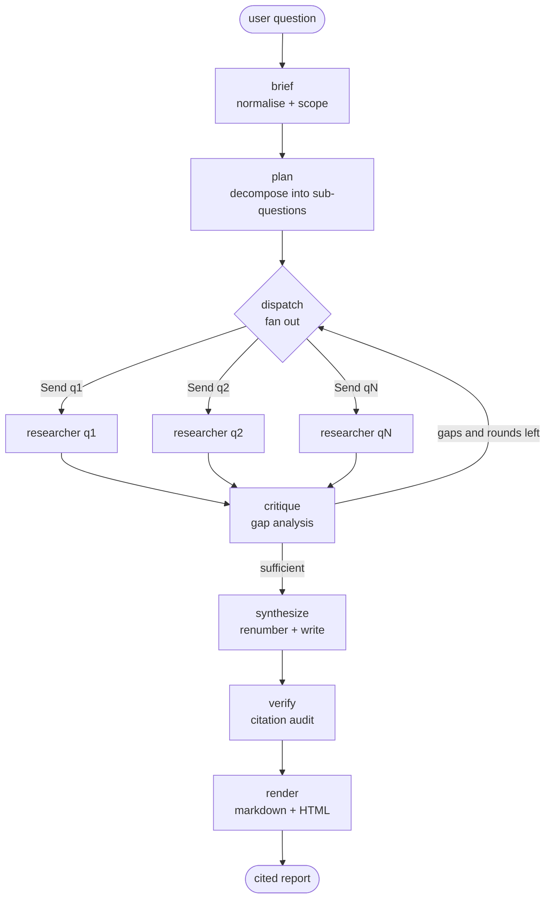

<div align="center">

# Muhaqqiq · مُحَقِّق

**A multi-agent research agent that refuses to publish a claim it cannot attribute to a source.**

[](https://www.python.org/)
[](https://langchain-ai.github.io/langgraph/)
[](https://gofastmcp.com/)
[](tests/)
[](LICENSE)

*Capstone project — Advanced Agentic AI Systems Engineering*
*هندسة أنظمة الذكاء الاصطناعي الوكيلي المتقدمة · SDAIA Academy · August 2026*

[العربية](README.ar.md) · [Example output](examples/run_example.md) · [Architecture](#architecture)

</div>

---

> **Runs with no API keys.** `uv sync && uv run muhaqqiq research "..."` executes the
> complete agent — planning, parallel research, self-critique, citation audit — against a
> bundled local corpus in about a second. Add keys to point the same graph at real models
> and the live web.

---

## Table of contents

- [The problem](#the-problem)
- [What Muhaqqiq does](#what-muhaqqiq-does)
- [How the agent works](#how-the-agent-works)
- [Architecture](#architecture)
- [Agent stack](#agent-stack)
- [Installation](#installation)
- [Configuration](#configuration)
- [Usage](#usage)
- [Example output](#example-output)
- [Design decisions](#design-decisions-and-why)
- [Testing](#testing)
- [Limitations](#limitations)
- [Future work](#future-work)
- [Project information](#project-information)

---

## The problem

Ask a language model a research question and you get fluent prose in five seconds. The
prose is often right. The problem is that **you cannot tell which parts are right**, and
neither can the model — it produces the same confident paragraph whether it retrieved
five relevant papers or nothing at all.

That failure has a specific shape:

| Failure | Why it happens | What it costs |
|---|---|---|
| Confident answers with no source | Generation is decoupled from retrieval | The reader must re-do the research to trust it |
| Invented citations | Nothing checks that `[3]` points at a real document | Worse than no citation — it *looks* verified |
| Silent retrieval failure | "I found nothing" and "the answer is X" are the same code path | The reader is misled with no signal |
| One-source summaries | No measure of source diversity | A summary of one blog post is presented as research |

So the reader ends up doing the work anyway: opening every link, checking whether the
document actually says what the summary claims it says. The agent saved no time; it
only moved the effort downstream and added a plausible-sounding draft to argue with.

**Who this is for.** Anyone who has to produce a defensible written answer from sources
they did not write: analysts, students, engineers scoping an unfamiliar technology,
anyone preparing a briefing where "I read it somewhere" is not an acceptable citation.

**What Muhaqqiq changes.** Every substantive sentence in the output carries a marker that
resolves to a real retrieved document, and the report tells you — at the top, before you
read a word of it — what share of its own claims are attributed, how many distinct sources
it rests on, and what it failed to find out. The agent is allowed to produce a weak report.
It is not allowed to produce a weak report that looks strong.

---

## What Muhaqqiq does

```
User question
      ↓
Agent normalises it into a bounded brief   ─── what is in scope, what is not
      ↓
Agent decomposes it into n sub-questions   ─── orthogonal, independently researchable
      ↓
n researcher agents run in parallel        ─── each sees only its own sub-question
      ↓                                         and its own retrieved sources
Critic audits coverage                     ─── thin evidence → one more retrieval round
      ↓                                         (bounded; it cannot loop forever)
Writer reconciles the sub-answers          ─── citations renumbered deterministically
      ↓
Citation auditor gates the result          ─── coverage, dangling markers, diversity
      ↓
Cited report + audit verdict + trace       ─── markdown · HTML · JSON
```

The name is Arabic: **مُحَقِّق**, *muḥaqqiq* — an investigator, and also the scholar who
verifies and authenticates a manuscript before it is published. Both meanings are the
brief.

---

## How the agent works

### 1. Brief — bound the question

The raw question is restated precisely and given explicit scope: what a good answer must
contain (`success_criteria`), what is deliberately excluded (`scope_out`), and who is
reading. Output is a typed `ResearchBrief`, not a paragraph.

### 2. Plan — decompose into orthogonal facets

The planner emits 3–5 `SubQuestion` objects, each with its own search queries. They are
required to be non-overlapping: if two sub-questions would be answered by the same
paragraph, they should have been one sub-question. The methodology for this step lives in
[`skills/research-planning/SKILL.md`](skills/research-planning/SKILL.md), not in the Python.

### 3. Research — fan out, in parallel, in isolation

`dispatch` emits one LangGraph `Send` per sub-question, so the researchers run
concurrently. **Each worker sees only its own sub-question and its own retrieved
documents.** That isolation is deliberate: workers who can read each other's conclusions
converge on a shared narrative before the evidence is in.

Each worker searches, applies a relevance floor to the results, and extracts evidence —
attaching a source id to every claim. Source ids are *provisional* at this stage (`S101`,
`S102`… for worker 1) so that parallel workers cannot collide on a number.

### 4. Critique — decide whether to pay for another round

The critic reads every sub-answer and asks whether any facet is resting on too little.
If so it emits follow-up queries and the graph **cycles back to `dispatch`** — but only
while `round < MUHAQQIQ_MAX_RESEARCH_ROUNDS`. An agent that can decide to keep going is
an agent that can decide never to stop; the bound is the whole point.

### 5. Synthesize — renumber, then write

Before anything is written, provisional ids are collapsed to a clean `S1…Sn` in order of
first appearance, documents found by more than one worker are aliased onto a single id,
and every marker in every sub-answer is rewritten to match. This is done **in Python, not
by the model** — renumbering is exactly the sort of bookkeeping that models get subtly and
silently wrong. Only then does the writer assemble the report.

### 6. Verify — the gate

The citation auditor splits the report into claim-sized sentences and checks four things:

| Check | Rule | On failure |
|---|---|---|
| **Coverage** | share of claims carrying a `[S#]` marker ≥ threshold (default 80%) | `fail` |
| **Resolution** | every marker points at a source that exists | `fail` — this is fabrication |
| **Diversity** | ≥ 3 distinct sources cited | `pass_with_warnings` |
| **Credibility** | flag cited sources rated low | `pass_with_warnings` |

This check is **plain Python — deliberately not an LLM call.** Asking a language model
whether its own output is grounded reintroduces the exact failure the check exists to
catch. Regex and set arithmetic do not hallucinate.

### 7. Render — show the reader the verdict

The audit result is printed **at the top of the delivered document**, not buried in a log:

> ✅ **Passed the citation audit.** Citation coverage **100%** (15/15 claims cited) ·
> **5** distinct sources cited · 1 critique round.

A reader who can see that coverage was 62% treats the document differently from one who
cannot. Hiding the number would defeat the purpose of computing it.

---

## Architecture


The agent graph itself, printable at any time with `muhaqqiq graph`:



### Repository layout

```
muhaqqiq/
├── src/muhaqqiq/
│   ├── agent.py           # public entry point: run_research() -> RunResult
│   ├── graph.py           # LangGraph wiring + dependency injection
│   ├── state.py           # typed graph state and its merge reducers
│   ├── schemas.py         # every inter-agent contract, as Pydantic models
│   ├── nodes/             # one module per graph stage
│   │   ├── brief.py  plan.py  research.py
│   │   └── critique.py  synthesize.py  verify.py
│   ├── audit.py           # the citation auditor (no LLM involved)
│   ├── llm.py             # reasoning providers + JSON-schema structured output
│   ├── offline.py         # the deterministic no-API-key reasoner
│   ├── tools.py           # the tool surface + BM25 corpus index
│   ├── mcp_server.py      # the same tools, served over MCP
│   ├── mcp_client.py      # the same tools, consumed over MCP
│   ├── skills.py          # Agent Skills loader
│   ├── render.py          # markdown + self-contained HTML
│   ├── store.py           # SQLite runs and search cache
│   ├── api.py             # FastAPI, incl. OpenResponses-compatible endpoint
│   └── cli.py             # command line interface
├── skills/                # methodology as reviewable text, loaded at runtime
│   ├── research-planning/SKILL.md   → stages: brief, plan
│   ├── source-triage/SKILL.md       → stages: research, critique
│   ├── report-writing/SKILL.md      → stage:  synthesize
│   └── citation-audit/SKILL.md      → stage:  verify
├── data/corpus/           # synthetic demo corpus (offline mode)
├── tests/                 # 83 tests, no network required
├── examples/              # a real run: markdown, HTML, JSON, trace
├── assets/                # architecture diagram (SVG + PNG + Mermaid)
├── Dockerfile · compose.yaml · Makefile
└── pyproject.toml · .env.example
```

---

## Agent stack

| Layer | Choice | Why this one |
|---|---|---|
| **Agent framework** | [LangGraph](https://langchain-ai.github.io/langgraph/) | The workload needs a *cycle* (critique → more research) and a *parallel fan-out* (independent sub-questions). A graph over a typed state expresses both natively; a linear chain expresses neither. |
| **Structured outputs** | Pydantic v2 | Every hop between agents is a validated object. A schema violation fails at the boundary where it happened instead of confusing a consumer three stages later. |
| **LLM** | [OpenRouter](https://openrouter.ai) + an offline reasoner | OpenRouter for model choice without vendor lock-in; the offline reasoner so the project runs, is testable, and is gradable with no credentials at all. |
| **Tools** | [FastMCP](https://gofastmcp.com/) | The tools are defined once and exposed two ways — in-process for the agent, over MCP for anything else. The decoupling is real; the operational cost during development is zero. |
| **Skills** | Agent Skills (`skills/*/SKILL.md`) | The agent's *methodology* is text on disk, loaded at runtime and injected per stage. A domain expert can change how the agent reasons without opening a `.py` file. |
| **Retrieval** | [Tavily](https://tavily.com) + a local BM25 index | Tavily for the live web; a small IDF-weighted BM25 index over a bundled corpus for offline runs and deterministic tests. |
| **API** | [FastAPI](https://fastapi.tiangolo.com/) + OpenResponses shape | Native typed API for anything built on top; a `/v1/responses` endpoint so existing responses-API clients work unchanged. |
| **Persistence** | SQLite | Runs are re-fetchable by id and retrieval is cached across runs. One file, no service to operate. |
| **Observability** | Built-in trace + optional [LangSmith](https://smith.langchain.com/) | Every run carries its own node-by-node trace *inside the artefact*. LangSmith when you want the dashboard; nothing breaks when you don't. |
| **Deployment** | Docker / Podman + Compose | Two services — agent and tool server — so the MCP path is exercised the way it would actually be deployed. |

Everything on this list earns its place. There is no vector database, because a
twenty-document corpus does not need one. There is no message queue, because nothing is
asynchronous across process boundaries. Adding components to lengthen the stack would
have made the system harder to run and no better at its job.

---

## Installation

```bash
git clone <repository-url>
cd muhaqqiq
uv sync --extra dev
```

<details><summary>Using pip instead of uv</summary>

```bash
python -m venv .venv && source .venv/bin/activate
pip install -e ".[dev]"
```

</details>

Optional configuration:

```bash
cp .env.example .env
```

You do not need to fill anything in. With an empty `.env` the agent runs in **offline
mode**: a deterministic local reasoner over a bundled corpus, no network, no keys. Add
keys only when you want real models and the live web.

Verify the installation:

```bash
uv run muhaqqiq doctor    # shows the resolved configuration and any silent downgrades
uv run pytest -q          # 83 tests, no network required
```

---

## Configuration

Everything is environment-driven, with a working default for every value. See
[`.env.example`](.env.example) for the full list.

| Variable | Default | Purpose |
|---|---|---|
| `MUHAQQIQ_LLM_PROVIDER` | `offline` | `offline` \| `openrouter` |
| `OPENROUTER_API_KEY` | — | Enables hosted models |
| `MUHAQQIQ_MODEL` | `anthropic/claude-sonnet-4.5` | Model for the writing stages |
| `MUHAQQIQ_FAST_MODEL` | `openai/gpt-4o-mini` | Model for planning and critique |
| `MUHAQQIQ_SEARCH_PROVIDER` | `offline` | `offline` \| `tavily` |
| `TAVILY_API_KEY` | — | Enables live web search |
| `MUHAQQIQ_MAX_SUBQUESTIONS` | `5` | Width of the parallel fan-out |
| `MUHAQQIQ_MAX_RESEARCH_ROUNDS` | `2` | Hard bound on the critique cycle |
| `MUHAQQIQ_MIN_CITATION_COVERAGE` | `0.8` | Coverage below this fails the audit |
| `MUHAQQIQ_USE_MCP` | `false` | Route tool calls through the MCP server |
| `LANGSMITH_TRACING` | `false` | Enable LangSmith |

**Credentials are never committed.** `.env` is git-ignored; `.env.example` contains only
variable names and placeholder values. If a provider is selected but its key is missing,
the agent does not crash and does not pretend — it downgrades to offline and reports the
downgrade in `muhaqqiq doctor`, in `/healthz`, and in the run's own metadata.

---

## Usage

### Command line

```bash
uv run muhaqqiq research "How do multi-agent orchestration patterns compare, and what are the main risks of deploying them?"
```

```
✅ Passed the citation audit. Citation coverage 100% (15/15 claims cited) ·
   5 distinct sources cited · 1 critique round(s).
...
╭─ run run_9f3a1c2e04b7 ─────────────────────────────────────────────╮
│ pass · coverage 100% · 5 sources cited · 42 tool calls · 72 ms     │
╰────────────────────────────────────────────────────────────────────╯
  markdown  out/run_9f3a1c2e04b7.md
  html      out/run_9f3a1c2e04b7.html
  json      out/run_9f3a1c2e04b7.json
```

Useful flags and other commands:

```bash
uv run muhaqqiq research "..." --depth deep --trace   # 5 facets, print the node trace
uv run muhaqqiq doctor                                # resolved configuration
uv run muhaqqiq skills                                # which Agent Skills loaded
uv run muhaqqiq tools                                 # the agent's whole action space
uv run muhaqqiq graph                                 # the architecture, as Mermaid
uv run muhaqqiq runs                                  # previous runs
uv run muhaqqiq show run_9f3a1c2e04b7                 # re-print a stored report
```

The process exits `2` when the audit verdict is `fail`, so the agent can be used in CI.

### HTTP API

```bash
uv run muhaqqiq serve         # http://localhost:8000  ·  docs at /docs
```

OpenResponses-compatible endpoint:

```bash
curl -X POST http://localhost:8000/v1/responses \
  -H "Content-Type: application/json" \
  -d '{
    "input": "How do multi-agent orchestration patterns compare, and what are their risks?"
  }'
```

```json
{
  "id": "run_9f3a1c2e04b7",
  "object": "response",
  "status": "completed",
  "output": [{ "type": "message", "role": "assistant",
               "content": [{ "type": "output_text", "text": "# How do multi-agent…" }] }],
  "usage": { "tool_calls": 42, "research_rounds": 1, "duration_ms": 72 },
  "metadata": { "verdict": "pass", "citation_coverage": 1.0, "sources_cited": 5 }
}
```

Full typed result, and long-running mode:

```bash
curl -X POST localhost:8000/v1/research -H 'Content-Type: application/json' \
  -d '{"question":"...","depth":"deep"}'

# return immediately with a run id, then poll
curl -X POST 'localhost:8000/v1/research?background=true' \
  -H 'Content-Type: application/json' -d '{"question":"..."}'
curl localhost:8000/v1/runs/run_9f3a1c2e04b7
curl localhost:8000/v1/runs/run_9f3a1c2e04b7/report.md
```

| Endpoint | Purpose |
|---|---|
| `POST /v1/responses` | OpenResponses-compatible |
| `POST /v1/research` | Full typed `RunResult`; `?background=true` to poll |
| `GET /v1/runs`, `/v1/runs/{id}` | Run history |
| `GET /v1/runs/{id}/report.{md,html}` | Rendered report |
| `GET /v1/config`, `/v1/tools`, `/graph` | Introspection |
| `GET /healthz` | Liveness + effective providers |

### As an MCP tool server

The retrieval tools are useful on their own, so they are also served over MCP — any
MCP-capable client can use them without importing this package:

```bash
uv run python -m muhaqqiq.mcp_server --http     # streamable HTTP on :8765
uv run python -m muhaqqiq.mcp_server            # stdio, for IDE clients
```

Point the agent at that server instead of its in-process tools:

```bash
MUHAQQIQ_USE_MCP=true MUHAQQIQ_MCP_URL=http://127.0.0.1:8765/mcp \
  uv run muhaqqiq research "..."
```

If the server is unreachable the agent logs the reason and falls back to in-process
tools. A research run should not die because a sidecar is down.

### Docker / Podman

```bash
docker compose up --build     # api on :8000, MCP tool server on :8765
curl localhost:8000/healthz
```

### Live models and live web

```bash
MUHAQQIQ_LLM_PROVIDER=openrouter    OPENROUTER_API_KEY=sk-... \
MUHAQQIQ_SEARCH_PROVIDER=tavily     TAVILY_API_KEY=tvly-...   \
  uv run muhaqqiq research "..."
```

Nothing else changes. The graph, the skills, the tools, the audit and the output format
are all provider-agnostic — which is the point of the abstraction.

---

## Example output

A complete run is committed to [`examples/`](examples/):

| File | What it is |
|---|---|
| [`run_example.md`](examples/run_example.md) | The report as delivered |
| [`run_example.html`](examples/run_example.html) | Self-contained HTML, light/dark |
| [`run_example.json`](examples/run_example.json) | The full typed `RunResult` |
| [`trace.json`](examples/trace.json) | The node-by-node execution trace |

Abridged:

```markdown
# How do multi-agent orchestration patterns compare, and what are the main risks…

> ✅ Passed the citation audit. Citation coverage 100% (15/15 claims cited) ·
> 5 distinct sources cited · 1 critique round(s).
>
> ⚠️ Provenance: this run used the bundled synthetic demo corpus…

## Key findings
- Three orchestration patterns dominate current multi-agent practice [S1].
- Cost in a multi-step agent run is dominated not by the number of steps but by
  context growth, because each step typically resends an accumulating history [S2].

## Approaches and trade-offs
This facet returned no evidence beyond what is already cited above; the retrieved
sources overlap with the preceding sections.

## Audit
- Verdict: `pass`
- Citation coverage: 100% (threshold 80%)
- Distinct sources cited: 5
```

Note the third section. The agent found nothing new for that facet and **said so**,
rather than paraphrasing an earlier section to fill the space. That behaviour is the
project working as designed, not a gap in it.

The trace that produced it:

```
t+5ms    start        run run_example
t+7ms    brief        normalised the question   topic="multi agent orchestration patterns"
t+8ms    plan         decomposed into 5 sub-questions
t+9ms    dispatch     round 1: dispatching 5 researcher(s)
t+24ms   researcher   q1: 2 source(s), 5 evidence item(s)
t+31ms   researcher   q5: 2 source(s), 5 evidence item(s)   <- out of order: parallel
t+44ms   researcher   q4: 3 source(s), 6 evidence item(s)
t+59ms   researcher   q3: 2 source(s), 5 evidence item(s)
t+68ms   researcher   q2: 3 source(s), 6 evidence item(s)
t+69ms   critique     coverage sufficient
t+70ms   synthesize   wrote 5 section(s) from 5 source(s)
t+71ms   verify       verdict=pass coverage=100%
t+72ms   render       rendered 5860 characters of markdown
```

> **On the demo corpus.** The bundled documents in `data/corpus/` are **synthetic** —
> written for this repository so the agent can be run and graded with no credentials.
> Every record is marked `"synthetic": true` and every report generated from them carries
> a provenance banner. An agent whose entire purpose is citation discipline should not be
> the thing that launders invented numbers into a document.

---

## Design decisions, and why

**Why an offline mode at all?**
A capstone that only runs when the assessor happens to own an API key is a capstone that
does not run. The offline reasoner implements the same structured-output contract as the
hosted provider using deterministic extractive logic over retrieved sources — it really
does plan, retrieve, extract and cite. It is unsophisticated, not fake. It also makes the
83-test suite fast and hermetic.

**Why is the auditor not an LLM?**
Because the thing being audited is whether an LLM's output is grounded. Using a second
model to check the first reproduces the original failure mode with extra steps and extra
cost. Coverage is a ratio, resolution is a set membership test, and diversity is a count.
All three are exactly computable.

**Why renumber citations in Python?**
Parallel workers must not collide on source ids, so they get disjoint provisional ranges.
Collapsing those to `S1…Sn`, aliasing duplicate documents, and rewriting every marker is
pure bookkeeping — and bookkeeping is where models fail quietly. A wrong citation number
is worse than a missing one, because it looks correct.

**Why does retrieval need a topic filter?**
Each sub-question searches the same subject with a different facet word appended
("… risks", "… outlook"). Those facet words are rare, so IDF gives them enormous weight,
and a document from an unrelated domain whose *title* contains one wins the ranking
outright. The fix is to let the topic decide eligibility and the query decide order.
There is a test named after this exact regression
([`test_topic_context_excludes_documents_from_another_domain`](tests/test_tools.py)).

**Why keep the tools in-process by default when MCP is implemented?**
An extra network hop and a second process are not free, and they are unwarranted for four
local functions during development. Defining the tools once and exposing them through both
transports gets the decoupling where it matters — deployment — without paying for it where
it does not.

---

## Testing

```bash
uv run pytest -q      # 83 passed
uv run ruff check src tests
```

No network access is required and no keys are used. Coverage of the parts that matter:

| Area | What is asserted |
|---|---|
| `test_audit.py` | Every verdict path: full coverage, uncited claims, dangling markers, single-source reports, low-credibility sourcing |
| `test_graph.py` | End-to-end run; every marker resolves; sources renumbered `S1…Sn` with no gaps; fan-out width matches the plan; the retry cycle is bounded; duplicate-document aliasing |
| `test_tools.py` | BM25 ranking, the cross-domain retrieval regression, morphology (`agentic` ↔ `agent`), caching, tool-call accounting |
| `test_api.py` | Both HTTP surfaces, including the exact OpenResponses shape and background runs |
| `test_skills_and_providers.py` | Skills load from disk and bind to stages; the hosted provider degrades to offline on API failure rather than dying; chatty JSON is recovered |
| `test_schemas.py`, `test_textkit.py` | Contract validation and the text primitives the auditor depends on |

---

## Limitations

Stated plainly, because understanding the limits of your own system is part of
understanding the system.

- **The bundled corpus is synthetic.** It exists to make the agent runnable and testable
  without credentials. Reports generated from it are internally consistent but factually
  fictional, and say so on their first screen.
- **The offline reasoner is extractive, not generative.** It selects and cites real
  sentences; it does not paraphrase, reconcile contradictions, or reason across sources.
  Prose quality with `MUHAQQIQ_LLM_PROVIDER=openrouter` is substantially better. The
  pipeline, not the writing, is what offline mode demonstrates.
- **Citation coverage measures attribution, not truth.** A sentence can be perfectly
  cited and still misrepresent the source. The auditor checks that a claim *has* support,
  not that the support says what the claim says. Entailment checking is future work.
- **Retrieval is shallow.** One search round per sub-question, top-k by BM25 or Tavily,
  no query rewriting, no re-ranking model, no chunk-level embedding retrieval.
- **Credibility scoring is a domain heuristic.** `.gov`/`.edu`/`arxiv` outranks a blog.
  That is a crude proxy and should not be mistaken for an assessment of the work.
- **No authentication on the API.** It is a prototype; it assumes a trusted network.
- **Live-mode costs are unbounded in absolute terms.** Rounds and sub-questions are
  bounded, tokens are not metered, and there is no spend cap.
- **English-centric text processing.** Arabic is detected and passed through, and the
  tokenizer handles Arabic script, but stemming and stopwords are tuned for English.
- **No automated evaluation harness.** Correctness is asserted structurally by the test
  suite; there is no benchmark of answer quality across a labelled question set.

---

## Future work

- **Entailment checking** — verify that a cited source actually supports its claim, closing
  the gap between "attributed" and "true".
- **An evaluation harness** — a labelled question set with trajectory-level metrics
  (tool calls, repeated calls, cost variance) alongside outcome quality.
- **Query rewriting and re-ranking** — let a failed retrieval round reformulate rather than
  simply repeat, and re-rank candidates before extraction.
- **Human-in-the-loop on the plan** — LangGraph checkpointing makes it natural to pause
  after `plan`, let a user edit the sub-questions, and resume.
- **Cost accounting and spend caps** — token metering per stage, with a hard budget.
- **Arabic-first processing** — proper Arabic stemming and stopwords so the offline
  reasoner works as well in Arabic as the hosted provider already does.

---

## Project information

**Course.** Advanced Agentic AI Systems Engineering
هندسة أنظمة الذكاء الاصطناعي الوكيلي المتقدمة
**Institution.** SDAIA Academy — 9–13 August 2026
**GitHub.** <https://github.com/SDAIAAcademy>

### Team

<!-- Replace the GitHub handle before submitting. -->

| Member | GitHub | Contribution |
|---|---|---|
| Alqahtani | `@your-handle` | Agent architecture, graph design, tool layer, API, documentation |

### Capstone checklist

| Requirement | Status |
|---|---|
| Agent runs successfully | ✅ `uv run muhaqqiq research "..."`, no keys required |
| Clearly defined problem | ✅ [The problem](#the-problem) |
| Clear reason to exist | ✅ Unverifiable research output is the failure being fixed |
| Available on GitHub with a useful README | ✅ This file |
| README explains problem, design and stack | ✅ [problem](#the-problem) · [design](#how-the-agent-works) · [stack](#agent-stack) |
| Architecture diagram | ✅ [SVG + PNG + Mermaid](assets/) |
| Another person can run it | ✅ [Installation](#installation) — three commands, zero credentials |
| No API keys or credentials committed | ✅ `.env` git-ignored; `.env.example` has placeholders only |
| Meaningful git history | ✅ Feature-scoped conventional commits |
| Course and Academy referenced | ✅ Above |

### License

MIT — see [LICENSE](LICENSE).
